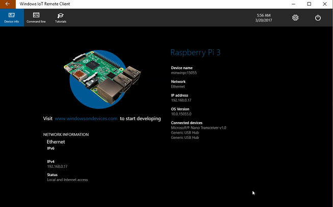

# Windows 10 IoT Core Dashboard

Windows 10 IoT Core Dashboard is the best way to download, set up and connect your Windows 10 IoT Core devices, all from your PC.

	<a href="http://go.microsoft.com/fwlink/?LinkID=708576" id="device-center-link" class="btn btn-primary">Download Dashboard</a>

## Set up a new device
___
The IoT Dashboard makes it easy to set up a new device. For detailed instructions on how to get started, see the [Get Started]({{site.baseurl}}/{{page.lang}}/GetStarted) page.

### SD card
The type, make and model of the SD card greatly affects both the performance and the quality of IoT Core.
A slow card can take up to five times longer to boot than our [recommended cards](media/hardwarecompatlist#Storage).
An older, less reliable SD card may not even work. If you continue to run into problems installing, consider replacing the SD card.

### Device Name
The default device name is minwinpc. We recommend changing it to something unique as this makes it easier to find the device on the network. The device name can be at most 15 characters long and can include letters, numbers and the following symbols:  @ # $ % ^ & ' ) ( . - _ { } ~
If you change the device name in IoT Dashboard when setting up your device, an automatic reboot will happen the first time when you power on the device.

### Password
Password is a mandatory field and must be set. Setting a password in IoT Dashboard modifies the password for Administrator user which by default is "p@ssw0rd".

### Wi-Fi Network connection
IoT Dashboard shows all available networks that your PC has previously connected to. If you don't see the desired Wi-Fi network on the list, ensure you're connected to it on your PC.
If you uncheck the box, you must connect an Ethernet cable to your board after flashing.

### First boot
The first boot will always take longer than all subsequent boots. The operating system will take some time to install and connect to your network.
Boot time can vary greatly based on your SD card. For example, a Raspberry Pi 3 running on our recommended SD card takes 3-4 minutes for first boot. On the same Pi with a poor quality SD card, we have seen boot times longer than 15 minutes.

### Connecting to the internet
Having your IoT Core device connect to the internet is essential. Many of the newer boards come with built in Wi-Fi adapters. If you have trouble getting connected to your network, try the following:

* Rebooting the device
* Plugging in an Ethernet cable
* Plugging in a monitor to the device. This will show you diagnostic information about your device



## My Devices
___
After your device is connected to the internet, the IoT Dashboard will automatically detect your device.
To find your device, go to **My Devices**. If your device is not listed, try rebooting the device. If your development machine is using WiFi IoTDashboard might not automatically find your device. Use the dispalyed IP Address when teh RPI boots. Make sure that if there are more than one devices on the network, they each have a unique name. Also make sure that your **windows10iotcoredashboard.exe** is allowed to communicate through Windows Firewall by following the steps below:

1. Open **Network and Sharing Center** and then find the type of network (Domain/Private/Public) your PC is connected to.
2. Open **Control Panel** and click **System and Security**.
3. Click **Allow an app through Windows Firewall** under **Windows Firewall**.
4. Click **Change settings**.
5. Find **windows10iotcoredashboard.exe** in **Allowed apps and features** and then enable the appropriate network check box (i.e. the network type you found in step 1).

### Connect to your device
Right click and select **Open in Device Portal**. This will launch the [Windows Device Portal]({{site.baseurl}}/{{page.lang}}/Docs/Tools/DevicePortal) page and is the best way to interact and manage your device.

You can also connect to the device using Windows PowerShell, SSH [see here](https://developer.microsoft.com/en-us/windows/iot/docs/ssh)), ftp (need to start it first [see here](https://developer.microsoft.com/en-us/windows/iot/docs/ftp)) and through File Explorer Remotely (Open Network Share).

The **"Launch IoT Remote Client"** option opens a GUI interface like Remoet Desktop. You have to enable it in the Device Portal first:

The Remote UI through IoT Remote Server

## Connect to Azure
___
IoT Dashboard lets you provision IoT Core devices with Azure IoT Hub. You can read more about it in this in **Lesson 3** or: [blog post](https://blogs.windows.com/buildingapps/2016/07/20/building-secure-apps-for-windows-iot-core)

##

[Back to Lesson 1](iot-hub-raspberry-pi-kit-win-10-iot-core-cs-lesson1-configure-your-device.md)

