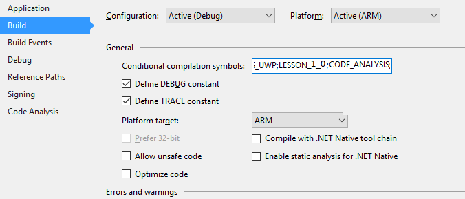

# THe Solutions

## What you will do
Clone the sample C# application Visual Studio solutions project from GitHub.

## What you will learn
In this article, you will learn:

* Clone a project from GitHub
* How to deploy and run the solutions project application on Pi.

## What you need
You must have successfully completed the following operations:

* [Configure your device](iot-hub-raspberry-pi-kit-win-10-iot-core-cs-lesson1-configure-your-device.md)
* [Boot your device](iot-hub-raspberry-pi-kit-win-10-iot-core-cs-lesson1-boot-your-device.md)
* [Get the tools](iot-hub-raspberry-pi-kit-win-10-iot-core-cs-lesson1-get-the-tools-win32.md)

---

# About
> The repository on GitHub contains a universal solution for these labs. You define a project sumbol depending on which activity you are doing which includes or excludes C# code depending upon the activity:

* The symbols and activities are:

    * LESSON_1_0: Periodic flash simulated LED

    * LESSON_1_1  Periodic Flash RPI LED

    * LESSON_2:   LED on when input is hi.
 
    * LESSON_3:   Send a string message to IoT Hub

    * LESSON_4:   Recv a message from IoT Hub

    * LESSON_5:   Send a message to IoT Hub when input is hi.
            
    * LESSON_6:   Get a command as a received message and action it.

    * LESSON_7:   Get a command as a commande and action it.

    * LESSON_8:   Read temperature and humidity data from SHT15 sensor

    * LESSON_9:   Send temperature and humidity data to IoT Hub

---


> [NOTE]
> Make sure that Pi is connected to the same network as your computer. For example, if your computer is connected to a wireless network while Pi is connected to a wired network, you might not see the IP address in the devdisco output. The safest way is to have your development machine and PI both on teh same wired network.


## Get the solutions project
Get and open the sample application, in one of two ways.:

1. Clone the sample repository from GitHub froma command line:

    * Create a suitable folder to host the project
    * Right click on it and run Git-Git Bash
    * Enter:
    ```bash
    git clone https://github.com/djaus2/Win10IoTCoreIoTHubLabs
    ```
    * Open the sample application in Visual Studio 2015 by openning it's solution file (.sln)

    OR

2. Browse to https://github.com/djaus2/Win10IoTCoreIoTHubLabs
    * Login to GitHub (Create a registraion if you don't have one).
    * Select Clone and choose the Visual Studio option
    * Open Visual Studio 2015 and choose the Team Explorer tab
    * Complete the cloning
    * Open the  project

## Examine the project code via the Solution Exlorer


**Examine the project References and note that Universal Windows 10 IoT-Core Extensions ARE included.** You make use of the RPI's **GPIO** in most lessons.

The downloaded project has the Lesson set as LESSON_1_0. This is set in the Project Property Pages tab- Build.

Examine the Conditional Compilation Symbols. LESSON_1_0 is embedded in it. 



> [Note:]
> Rather than have multiple versions of the MainApp for different lessons, you will just change this symbol in later lessons.
> For example for the *"Send a string message to IoT Hub"* activity you change this symbol to *LESSON_3*.

## Run the app on the PI
* Set project to ARM and Remote Device
* Set the appropriate compilation symbol for the activity that you want on the project's Build tab
    * Note when you change CPU or build type you have to re-enter these symbols.
* Configure the target to your rPI (as per previous page).
* Build and deploy the app.
 
---

## Summary
This page tellls you how to get the solutions for the lessons in these labs.


