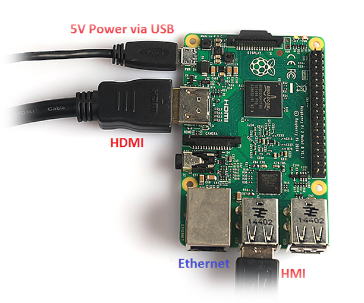
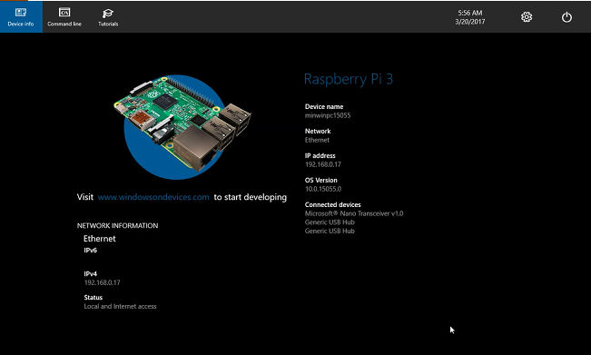
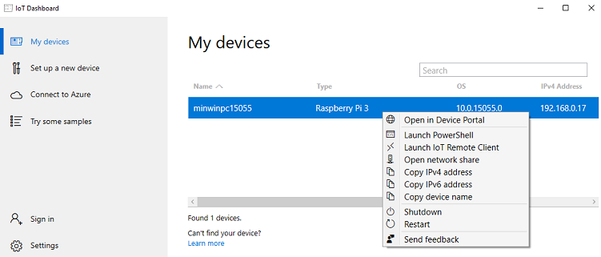
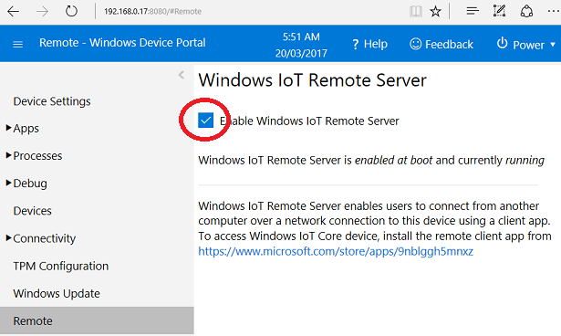
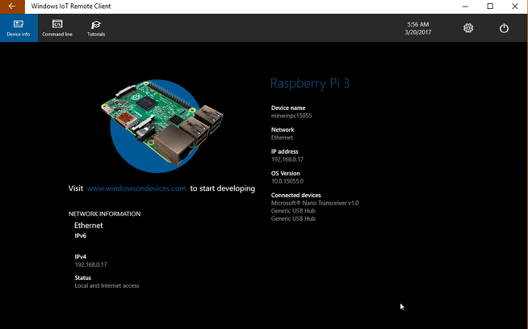

# Boot your device
## What you will do
Connect up the RPI for booting, boot and examine. 

## What you will learn
In this article, you will learn:

* How to boot the RPI once setup.
* What to expect.
* Exploring the booted device with IoT Dashboard, Device Manager and Remote.

## Initial setup
As per [Setup your device](iot-hub-raspberry-pi-kit-win-10-iot-core-cs-lesson1-setup-your-device.md)

## Peripherals
* Connect an HDMI monitor via the RPI HDMI connector using an HDMI cable.
* Connect a keyboard and mouse via the RPI USB ports. Wireless HMI devices work seamlessly.

## Boot the device
* Power it up

### First boot
The first boot will always take longer than all subsequent boots. The operating system will take some time to install and connect to your network.
Boot time can vary greatly based on your SD card. For example, a Raspberry Pi 3 running on our recommended SD card takes 3-4 minutes for first boot. On the same Pi with a poor quality SD card, we have seen boot times longer than 15 minutes.

* Examine the booted device's diagnostic diagnostic (IP Address etc). Examine the menu options. You might like to try rebooting the device.

### Connecting to the internet
Having your IoT Core device connect to the internet is essential. For development, cable is simplest. Many of the newer boards come with built in Wi-Fi adapters  (eg RPI 3). See the Device Settings menu (second on right) -> Network & WiFi to setup WiFi. Click on your WiFi network and configure with its key similarly as per the desktop. You may need to reboot.

If you have trouble getting connected to your network, try the following:

* Rebooting the device
* Plugging in an Ethernet cable
* Examine the diagnostic information about your device



**Make sure that you you have a valid IP Address (wired or WiFi) before proceeding.**

## My Devices
___
After your device is connected to the internet, the IoT Dashboard will automatically detect your device.
To find your device, go to **My Devices**. If your device is not listed, try rebooting the device. If your development machine is using WiFi IoTDashboard might not automatically find your device. Use the dispalyed IP Address when teh RPI boots. Make sure that if there are more than one devices on the network, they each have a unique name. Also make sure that your **windows10iotcoredashboard.exe** is allowed to communicate through Windows Firewall by following the steps below:

1. Open **Network and Sharing Center** and then find the type of network (Domain/Private/Public) your PC is connected to.
2. Open **Control Panel** and click **System and Security**.
3. Click **Allow an app through Windows Firewall** under **Windows Firewall**.
4. Click **Change settings**.
5. Find **windows10iotcoredashboard.exe** in **Allowed apps and features** and then enable the appropriate network check box (i.e. the network type you found in step 1).

### Connect to your device
Right click and select **Open in Device Portal**. This will launch the [Windows Device Portal]({{site.baseurl}}/{{page.lang}}/Docs/Tools/DevicePortal) page and is the best way to interact and manage your device.

You can also connect to the device using Windows PowerShell, SSH ([see here](https://developer.microsoft.com/en-us/windows/iot/docs/ssh)), ftp (need to start it first [see here](https://developer.microsoft.com/en-us/windows/iot/docs/ftp)) and through File Explorer Remotely (Open Network Share).

The **"Launch IoT Remote Client"** option opens a GUI interface like Remote Desktop. You have to enable it in the Device Portal first:

The Remote UI through IoT Remote Server

## Next steps

[Get the tools](iot-hub-raspberry-pi-kit-win-10-iot-core-cs-lesson1-get-the-tools-win32.md)
