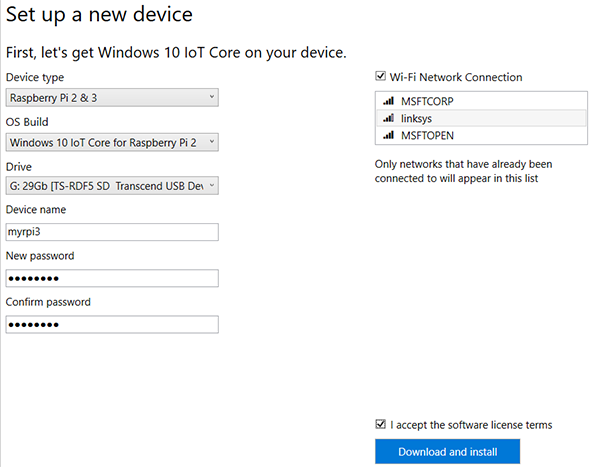
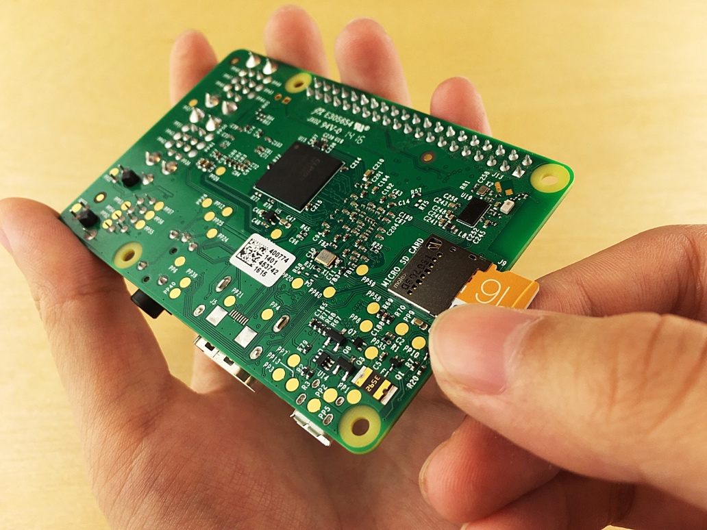
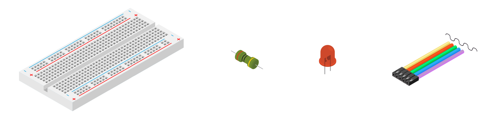
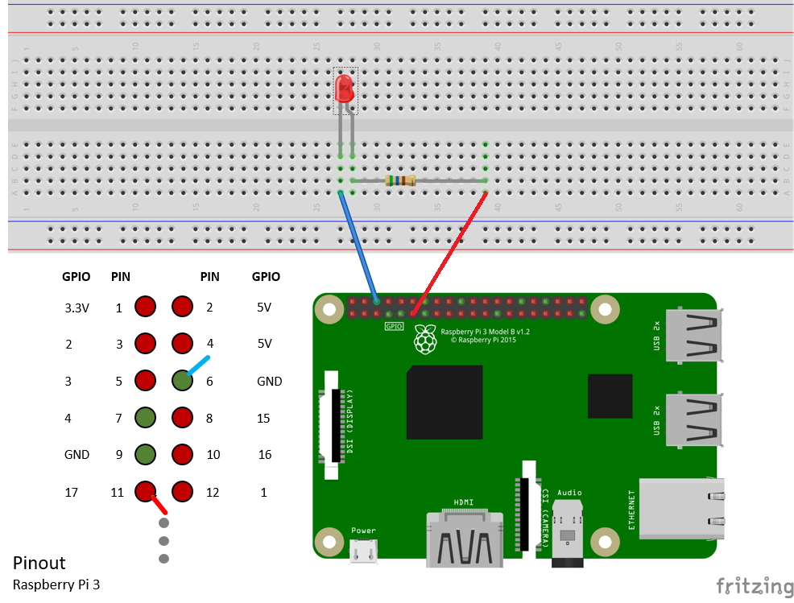
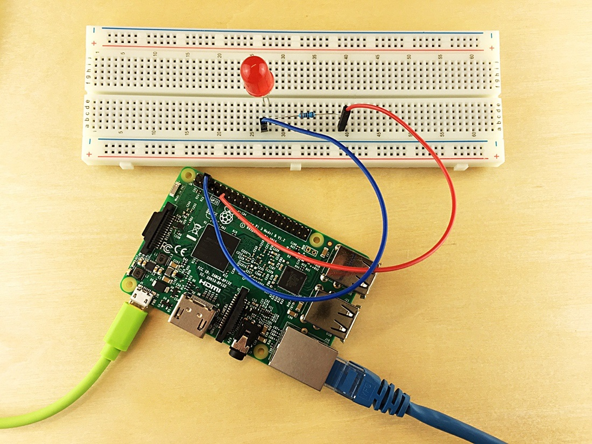

# Configure your device
## What you will do
Configure Pi for first-time use and install the Windows 10 IoT-Core operating system. Windows 10 IoT-Core is free to download. If you have any problems, look for solutions on the [troubleshooting page](iot-hub-raspberry-pi-kit-win-10-iot-core-cs-troubleshooting.md).
## What you will learn
In this article, you will learn:

* How to install Windows 10 IoT-Core on Pi.
* How to power up Pi by using a USB cable.
* How to connect Pi to the network by using an Ethernet cable or wireless network.
* How to add an LED to the breadboard and connect it to Pi.

## What you need
To complete this operation, you need the following parts from your Raspberry Pi 3 Starter Kit:

* The Raspberry Pi 3 board
* The 16-GB microSD card
* The 5-volt 2-amp power supply with the micro USB cable. Can come from PC.
* The breadboard
* Connector wires
* A 560-ohm resistor
* A diffused 10-mm LED
* The Ethernet cable

You also need:

* A wired or wireless connection for Pi to connect to.
* A USB-SD adapter or mini-SD card to burn the OS image onto the microSD card.
* A computer running Windows, Mac, or Linux. The computer is used to install Windows 10 IoT-Core on the microSD card.
* An Internet connection to download the necessary tools and software.

# Install Windows 10 IoT-Core on the MicroSD card
Prepare the microSD card for installation of the Windows 10 IoT-Core image using **IoTDashboard**

## Windows 10 IoT Core Dashboard

Windows 10 IoT Core Dashboard is the best way to download, set up and connect your Windows 10 IoT Core devices, all from your PC.

	<a href="http://go.microsoft.com/fwlink/?LinkID=708576" id="device-center-link" class="btn btn-primary">Download and install IoT Core Dashboard</a>

### Set up a new device
___
The IoT Dashboard makes it easy to set up a new device. For detailed instructions on how to get started, see the [Get Started]({{site.baseurl}}/{{page.lang}}/GetStarted) page.

You set up the SD card for installation by selecting items from the first three dropdown menus and entering the other required information. If you wish to use a downloaded image, select **Other** from the **Device Type**. You will be directed to browse to the .ffu file location, typically in **C:\Program Files (x86)\Microsoft IoT\FFU**

#### SD card
The type, make and model of the SD card greatly affects both the performance and the quality of IoT Core.
A slow card can take up to five times longer to boot than our [recommended cards](media/hardwarecompatlist#Storage).
An older, less reliable SD card may not even work. If you continue to run into problems installing, consider replacing the SD card.

#### Device Name
The default device name is minwinpc. We recommend changing it to something unique as this makes it easier to find the device on the network. The device name can be at most 15 characters long and can include letters, numbers and the following symbols:  @ # $ % ^ & ' ) ( . - _ { } ~
If you change the device name in IoT Dashboard when setting up your device, an automatic reboot will happen the first time when you power on the device.

#### Password
Password is a mandatory field and must be set. Setting a password in IoT Dashboard modifies the password for Administrator user which by default is "p@ssw0rd".

#### Wi-Fi Network connection
IoT Dashboard shows all available networks that your PC has previously connected to. If you don't see the desired Wi-Fi network on the list, ensure you're connected to it on your PC.
If you uncheck the box, you must connect an Ethernet cable to your board after flashing.

**Once you have flashed the SD card with the OS image from the .ffu file, insert the card:**

## Connect power 
Connect power to the Pi by using the micro USB cable and the power supply. *Don't turn on yet.*  For small loads on the PI, you typically can use a PC USB port. Note unlike the Arduino, this is not used for programming the device.

> [!NOTE]
> It is important to use the power supply in the kit that is at least 2A to make sure that your Raspberry has enough power to work correctly.

## Connect Raspberry Pi 3 to the network
You can connect Pi to a wired network or to a wireless network. Make sure that Pi is connected to the same network as your computer. For example, you can connect Pi to the same switch that your computer is connected to.

### Connect to a wired network
Use the Ethernet cable to connect Pi to your wired network. The two LEDs on Pi turn on if the connection is established.

### Connect to a wireless network
This option will be covered later.

## Connect the LED to Pi
To complete this task, use the [breadboard](https://learn.sparkfun.com/tutorials/how-to-use-a-breadboard), the connector wires, the LED, and the resistor. Connect them to the [general-purpose input/output](https://www.raspberrypi.org/documentation/usage/gpio/) (GPIO) ports of Pi.

1. Connect the shorter leg of the LED to **GPIO GND (Pin 6)**.
2. Connect the longer leg of the LED to one leg of the resistor.
3. Connect the other leg of the resistor to **GPIO 0 (Pin 11)**.

Note that the LED polarity is important. This polarity setting is commonly known as Active Low.

Congratulations! You've successfully configured Pi.

## Summary
In this article, you’ve learned how to configure Pi by installing Windows 10 IoT-Core, connecting Pi to a network, and connecting an LED to Pi. Note that the LED doesn't yet light up. The next task is to install the necessary tools and software in preparation for running a sample application on Pi.

## Next steps
[Boot your device](iot-hub-raspberry-pi-kit-win-10-iot-core-cs-lesson1-boot-your-device.md)

