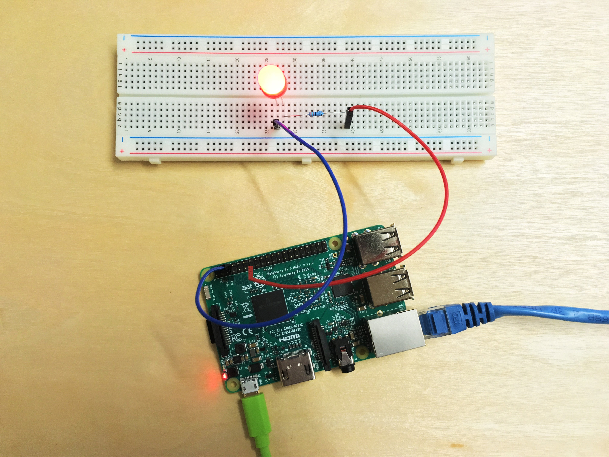

# Create and deploy the blink application
## What you will do
Use the Visual Studio to deploy the sample application to Raspberry Pi 3. The sample application blinks the LED connected to the board every two seconds. If you have any problems, look for solutions on the [Project Solutions Repository)](iot-hub-raspberry-pi-kit-win-10-iot-core-cs-Project-Solution-Repository.md).

## What you will learn
In this article, you will learn:

* How to deploy and run the sample application on Pi.
* How to deploy and debug applications running remotely on Pi.

## What you need
You must have successfully completed the following operations:

* [Setup your device](iot-hub-raspberry-pi-kit-win-10-iot-core-cs-lesson1-setup-your-device.md)
* [Boot your device](iot-hub-raspberry-pi-kit-win-10-iot-core-cs-lesson1-boot-your-device.md)
* [Get the tools](iot-hub-raspberry-pi-kit-win-10-iot-core-cs-lesson1-get-the-tools-win32.md)
* [Setup LED Hardware](iot-hub-raspberry-pi-kit-win-10-iot-core-cs-lesson1-setup-led-hw-on-your-device.md)


> [!NOTE]
> Make sure that Pi is connected to the same network as your computer. For example, if your computer is connected to a wireless network while Pi is connected to a wired network, you might not see the IP address in the devdisco output.


**Make sure that in the project References Universal Windows 10 IoT-Core Extensions ARE included.** You make use of the RPI's **GPIO** in this lesson.


> [Note:]
> Rather than have separate versions of the MainApp for different lessons, you will just change this symbol in later lessons.

Modify the Loop(0 method in MainPage.xaml.cs to:

```c#

        public async Task Loop()
        {
            for (int i = 0; i <  numLoops; i++)
            {
                //Simulation code from previous lesson
                await this.Dispatcher.RunAsync(CoreDispatcherPriority.Normal,
                () =>
                {
                    LED.Fill = redBrush;
                });
                IoTGPIO.LEDOn();

                //Periodic Flash LED only

                //Pause 400 mS for all
                await System.Threading.Tasks.Task.Delay(TimeSpan.FromMilliseconds(400));

                //Simulation code from prvious lesson
                await this.Dispatcher.RunAsync(CoreDispatcherPriority.Normal,
                () =>
                {
                    LED.Fill = redBrush;
                });
                IoTGPIO.LEDOff();

                //Pause 600 mS for all
                await System.Threading.Tasks.Task.Delay(TimeSpan.FromMilliseconds(600));
            }          
            Application.Current.Exit();
        }
```
So The LED gets turned off and on periodically. We leave the simulated blink in place.

Add a new class to the project called IoTGPIO, which will add a file IoTGPIO.cs.

* Add GPIO Initialisation method to the IoTGPIO class that will fail *("gracefully")* if the app isn't running on a **Windows 10 IoT-Core device**.
```c#
        public static void InitGPIO()
        {
            var gpio = GpioController.GetDefault();

            // Show an error if there is no GPIO controller
            if (gpio == null)
            {
                OutPin = null;
                Debug.WriteLine("There is no GPIO controller on this device.");
                return;
            }

            OutPin = gpio.OpenPin(LED_PIN);
            pinValue = GpioPinValue.High;
            OutPin.Write(pinValue);
            OutPin.SetDriveMode(GpioPinDriveMode.Output);

            Debug.WriteLine("GPIO pin initialized correctly.");

        }
```

* Implement the LEDOn() and LEDOff() methods in IoTGPIO class by adding the following code to it:

The LEDOn() and LEDOff() methods are:
```c#
        public static void LEDOn()
        {
            pinValue = GpioPinValue.High;
            OutPin.Write(pinValue);
            Debug.WriteLine("LED On");
        }

        public static void LEDOff()
        {
            pinValue = GpioPinValue.Low;
            OutPin.Write(pinValue);
            Debug.WriteLine("LED Off");
```

## Run the app
* Set project to ARM and Remote Device (as per previous page)
* Configure the target to your RPI (as per previous page).
* Build and deploy the app.
 

### Verify the app works
The sample application terminates automatically after the LED blinks for 20 times. If you don’t see the LED blinking, see the solution.
(iot-hub-raspberry-pi-kit-win-10-iot-core-cs-Project-Solution-Repository.md)(iot-hub-raspberry-pi-kit-win-10-iot-core-cs-troubleshooting.md) for solutions to common problems.



---

## The solution
See [Project Solutions Repository)](iot-hub-raspberry-pi-kit-win-10-iot-core-cs-Project-Solution-Repository.md)

Set the lesson symbol to **LESSON_1_1**

## Summary
You've installed the required tools to work with Pi and deployed a sample application to Pi to blink the LED. You can now create, deploy, and run another sample application that connects Pi to Azure IoT Hub to send and receive messages.

## Next steps

* Get Azure Tools

[Back to Index](iot-hub-raspberry-pi-kit-win-10-iot-core-cs-get-started.md)

