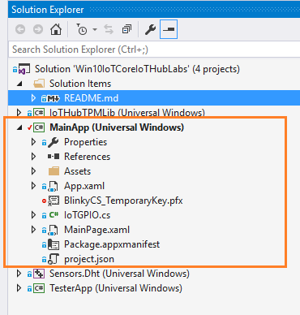

# Create and deploy the blink application
## What you will do
Clone the sample C# application from GitHub, and use the Visual Studio to deploy the sample application to Raspberry Pi 3. The sample application blinks the LED connected to the board every two seconds. If you have any problems, look for solutions on the [troubleshooting page](iot-hub-raspberry-pi-kit-win-10-iot-core-cs-troubleshooting.md).

## What you will learn
In this article, you will learn:

* Clone a project from GitHub
* How to deploy and run the sample application on Pi.
* How to deploy and debug applications running remotely on Pi.

## What you need
You must have successfully completed the following operations:

* [Configure your device](iot-hub-raspberry-pi-kit-win-10-iot-core-cs-lesson1-configure-your-device.md)
* [Boot your device](iot-hub-raspberry-pi-kit-win-10-iot-core-cs-lesson1-boot-your-device.md)
* [Get the tools](iot-hub-raspberry-pi-kit-win-10-iot-core-cs-lesson1-get-the-tools-win32.md)


> [!NOTE]
> Make sure that Pi is connected to the same network as your computer. For example, if your computer is connected to a wireless network while Pi is connected to a wired network, you might not see the IP address in the devdisco output.

## Open the sample application
Get and open the sample application, in one of two ways.:

1. Clone the sample repository from GitHub by running the following command:

    * Create a suitable folder to host the project
    * Right click on it and run Git-Git Bash
    * Enter:
    ```bash
    git clone https://github.com/djaus2/Win10IoTCoreIoTHubLabs
    ```
    * Open the sample application in Visual Studio 2015 by openning it's solution file (.sln)

2. Browse to https://github.com/djaus2/Win10IoTCoreIoTHubLabs
    * Login to GitHub (Create a registraion if you don't have one).
    * Select Clone and choose the Visual Studio option
    * Open Visual Studio 2015 and choose the Team Explorer tab
    * Complete the cloning
    * Open the  project

## Examine the project code via the Solution Exlorer


Note the various subprojects in the solution. In this Lesson you will only use the MainApp project:




**Examine the project References and note that Universal Windows 10 IoT-Core Extensions ARE included.** You make use of the RPI's **GPIO** in this lesson.

The downloaded project has the Lesson set as LESSON1. This is enforced in the Project Property Pages tab- Build.

Examine the Conditional Compilation Symbols. LESSON1 is embedded in it. 


> [Note:]
> Rather than have separate versions of the MainApp for different lessons, you will just change this symbol in later lessons.

The MainPage.xaml.cs code thus simplifies to:

```c#

        public MainPage()
        {
            // ...

            IoTGPIO.InitGPIO();

            if (IoTGPIO.OutPin != null)
            {

                var t = Task.Run(() => Loop());
            }

        }

        public async Task Loop()
        {
            for (int i = 0; i <  numLoops; i++)
            {
                //Simulation code from previous lesson
                IoTGPIO.LEDOn();

                //Periodic Flash LED only

                //Pause 400 mS for all
                await System.Threading.Tasks.Task.Delay(TimeSpan.FromMilliseconds(400));

                //Simulation code from prvious lesson
                IoTGPIO.LEDOff();

                //Pause 600 mS for all
                await System.Threading.Tasks.Task.Delay(TimeSpan.FromMilliseconds(600));
            }          
            Application.Current.Exit();
        }
```
So The LED gets turned off and on periodically. The app does not use an UX apart from its Splash screen. We could usea simulated blink (ToDo).

The IoTGPIO class is implemented in **IoTGPIO.cs**. OPen the file and examine it. There is an GPIO Initialisation method that will fail *("gracefully")* if the app isn't running on a **Windows 10 IoT-Core device**.
The LEDOn() and LEDOff() methods are:
```c#
        public static void LEDOn()
        {
            pinValue = GpioPinValue.High;
            OutPin.Write(pinValue);
            Debug.WriteLine("LED On");
        }

        public static void LEDOff()
        {
            pinValue = GpioPinValue.Low;
            OutPin.Write(pinValue);
            Debug.WriteLine("LED Off");
```

## Run the app
* Set project to ARM and Remote Device (as per previous page)
* Configure the target to your rPI (as per previous page).
* Build and deploy the app.
 

### Verify the app works
The sample application terminates automatically after the LED blinks for 20 times. If you don’t see the LED blinking, see the [troubleshooting guide](iot-hub-raspberry-pi-kit-win-10-iot-core-cs-troubleshooting.md) for solutions to common problems.


## Summary
You've installed the required tools to work with Pi and deployed a sample application to Pi to blink the LED. You can now create, deploy, and run another sample application that connects Pi to Azure IoT Hub to send and receive messages.

## Next steps
[Get Azure tools](iot-hub-raspberry-pi-kit-win-10-iot-core-cs-lesson2-get-azure-tools-win32.md)

