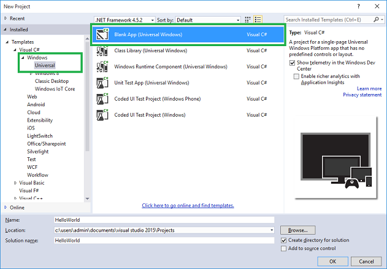
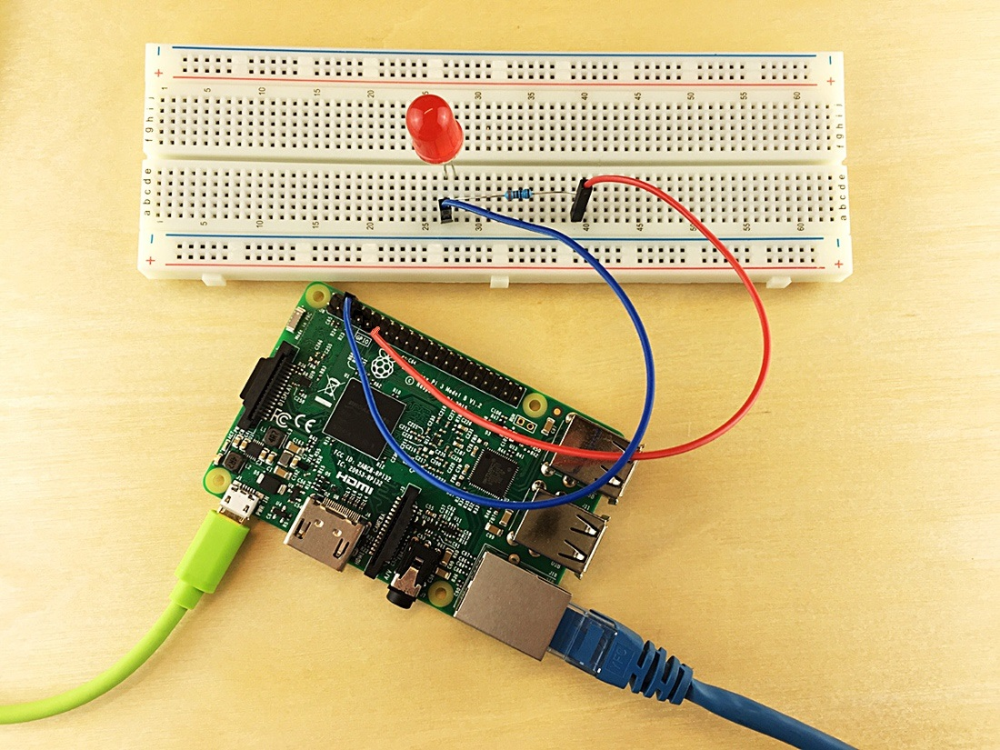
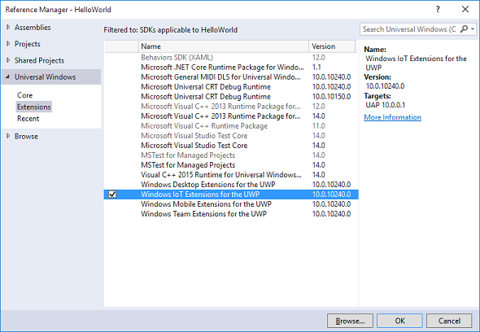
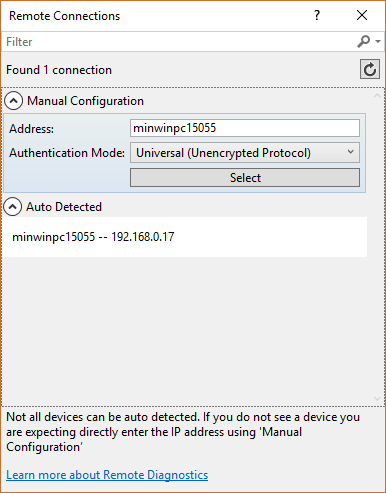

# Get the tools (Windows 7 or later)

> [!div class="op_single_selector"]
> * [Windows 7 or later](iot-hub-raspberry-pi-kit-win-10-iot-core-cs-lesson1-get-the-tools-win32.md)

## What you will do
Download the development tools and software for the first sample application for Raspberry Pi 3. If you have any problems, look for solutions. See  [Project Solutions Repository)](iot-hub-raspberry-pi-kit-win-10-iot-core-cs-Project-Solution-Repository.md).


## What you will learn
In this article, you will learn:

* How to install Git and Visual Studio 2017/2015.
  * [Git](https://git-scm.com) is an open source distributed version control system. The sample application for this article is stored on GitHub.

  * [Visual Studio 2015/Update 3]()  You need least Update 3
    * ??:  [Visual Studio 2017](https://www.visualstudio.com/downloads/) is a JavaScript runtime with a rich package ecosystem.

* Create and run a simple LED simulation UWP app on the RPI
  

## What you need

To complete this operation, you will need:

* An Internet connection to download the development tools and the software.
* A computer that is running Windows.

## Install Visual Studio 2015 Update 3 
Ref:  [Here](https://developer.microsoft.com/en-US/windows/iot/Docs/GetStarted/rpi3/sdcard/stable/getstartedstep3)

Visual Studio 2017 may work ??

### Set up your development environment to explore and run the IoT samples. 

* Download and install Visual Studio Community 2015 from [here](http://go.microsoft.com/fwlink/?LinkID=534599).
*NOTE: Visual Studio Professional 2015 and Visual Studio Enterprise 2015 can be downloaded. If you choose to install a different edition of Visual Studio make sure to do a custom installation and select Universal Windows App Development Tools > Tools and Windows SDK.* 
* Include the GIT Visual Studio option.
* Update Visual Studio 2015, if necessary.
Install Update 3 from the Extensions and Update dialog in Visual Studio or from [here](http://go.microsoft.com/fwlink/?LinkId=691129) 
* Install the Windows IoT project templates.
Download and install the IoT templates from the Visual Studio Gallery [here](https://visualstudiogallery.msdn.microsoft.com/55b357e1-a533-43ad-82a5-a88ac4b01dec).
Alternatively, the templates can be found by searching for Windows IoT Core Project Templates in the [Visual Studio Gallery](https://visualstudiogallery.msdn.microsoft.com/0) or directly from Visual Studio in the Extension and Updates dialog (Tools > Extensions and Updates > Online). 
* Validate your installation
  * Select Help > About Microsoft Visual Studio to display version information.
  * The required version of Visual Studio is 14.0.25123.00 Update 3.
  * The required version of Visual Studio Tools for Universal Windows Apps is 14.0.25208.00.
* Enable developer mode on your device running Visual Studio. Instructions are here. 

## install Git for Windows.

  * [Get Git for Windows](https://git-scm.com/download/win/)
  * Choose teh File Explorer options that enable to Run Bash command shells directly from Explorer


## Create a sample app and run it on the RPI
Ref: [Hello World UWP app](https://developer.microsoft.com/en-us/windows/iot/samples/helloworld)

In this sample, you will create and deploy the proverbial 1st app, “Hello, world!” to any device running Windows 10 IoT Core.

### 1. Create a new C# project

All of the sample code is available to download, but as an exercise, this tutorial will take you through the complete steps to create this app from scratch. You need to make sure you have installed the Windows 10 IoT Core Project Templates from here.
* Start Visual Studio 2015.
* Create a new project with (File | New Project…).
* In the New Project dialog, navigate to Universal as shown below (in the left pane in the dialog: Templates | Visual C# | Windows | Universal).
* Select the template Blank App (Windows Universal).
* Remember to give it a good name to your first app! In this example, we called the project ‘HelloWorld’.



> [!NOTE]
>If this is the first project you create, Visual Studio will likely prompt you to enable [Developer mode for Windows 10](https://msdn.microsoft.com/library/windows/apps/xaml/dn706236.aspx).

### 2. Create a UX using XAML

From Solution Explorer, select the MainPage.xaml file. We want toa add a background image and an ellipse as a simulated LED. To LED (ellipse) will periodically change from Red to Gray, ie "flash". 

So edit the XAML file to add these elements: Locate the *Grid* tag in the XAML section of the designer, and embellish it as follows. Note you need to show the xaml code, click on its tab.

```c#
  <Grid RenderTransformOrigin="0.257,0.127" >
      <Grid.Background>
          <ImageBrush ImageSource ="hardware_ready.png" Stretch="None"></ImageBrush>
      </Grid.Background>

      <Ellipse x:Name="LED" Fill="LightGray" Stroke="White" Width="60" Height="70" Margin="78,10,222,560" RenderTransformOrigin="-0.22,-1.273"/>

  </Grid>
```


We want to initiate a simulated flashing lED when the XAML form is loaded. Modify the last line of the  **Page** tag above the grid one from

```c#
    mc:Ignorable="d" >
```  
to be
```c#
    mc:Ignorable="d" Loaded="Page_Loaded">
```   

The background image *(as specified in the grid xaml code)* is a file that looks like the harwdare we will use later, as below. Right-click on it and save it in the root of your project.



*hardware_ready.png*   

Add a handler for Page_Loaded() in MainPage.xaml.cs:

```c#
      private void Page_Loaded(object sender, RoutedEventArgs e)
      {
          var t = Task.Run(() => Loop());
      }
``` 

This will cause the Loop() method to run once the page is loaded. You can't interact with UX elements until the page is loaded.

Implement the Loop() method, also in MainPage.xaml.cs

```c#
      int numLoops = 20;
      public async Task Loop()
      {
          for (int i = 0; i < numLoops; i++)
          {
              await this.Dispatcher.RunAsync(CoreDispatcherPriority.Normal,
              () =>
              {
                  LED.Fill = redBrush;
              });

              //Periodic flash simulated LED

              //Pause 400 mS
              await System.Threading.Tasks.Task.Delay(TimeSpan.FromMilliseconds(400));

              await this.Dispatcher.RunAsync(CoreDispatcherPriority.Normal,
              () =>
              {
                  LED.Fill = grayBrush;
              });

              //Pause 600 mS
              await System.Threading.Tasks.Task.Delay(TimeSpan.FromMilliseconds(600));

          }

          Application.Current.Exit();
      }
``` 

Finally add the following declarations at the top of the MainPage class in MainPage.xaml.cs 

```c#
      private SolidColorBrush redBrush = new SolidColorBrush(Windows.UI.Colors.Red);
      private SolidColorBrush grayBrush = new SolidColorBrush(Windows.UI.Colors.LightGray);
```

### 3. Run the app on your development machine
* By default the app should be configured to run as an x86 app, in Debug mode on your local machine
* Press F5 or Debug-Run
* Close the app after testing the button functionality.
* Put a Breakpoint in Loop() at the first await line of code(click on the LOC, press F9 ) line, run the app again and see that the app breaks at that LOC.
* F5 again to continue. After  a few loops press F9 at teh breakpoint to remove it, then F5 to continue runningto completeion.

### 4. Add a reference to the Windows IoT extension SDK

Since the IoT extension SDK is not added to projects by default, you'll need to add a reference so that namespaces like **Windows.Devices.Gpio** will be available in the project, as used to access the real LED later in this lesson. To do so, just right-click on the **References** entry under the project, Select **“Add Reference”** then navigate the resulting dialog to **Universal Windows->Extensions->Windows IoT Extensions for the UWP**, check the box, and click OK.



### 5. Configure the app on your RPI

* Boot your RPI if its not alreaddy running
* Set the Build to ARM (RPI is an ARM CPU)
* Set the Target to Remote Device. A dialog will pop up:



* Note that the PI is detected, which you select as the target if not doeneautomatically.
* The Authentication must be Universal(Unencrypted)Protocol
* You can access that dialog via the project properties - Debug tab
* You can also just enter the device's IP Address for the name, which can be useful with WiFi networks when the device isn't detected.

### 6. Run the app on your RPI
* F5 again.  Test Breakpoints.

---

## The Solution
[See Project Solutions Repository)](iot-hub-raspberry-pi-kit-win-10-iot-core-cs-Project-Solution-Repository.md)

## Summary

You've installed the required development tools and software for the first sample application. You have run a simple UWP app on the device.  The next task is to create, deploy, and run the sample LED application on Pi.


## Next steps

[Setup LED Hardware](iot-hub-raspberry-pi-kit-win-10-iot-core-cs-lesson1-setup-led-hw-on-your-device.md)

