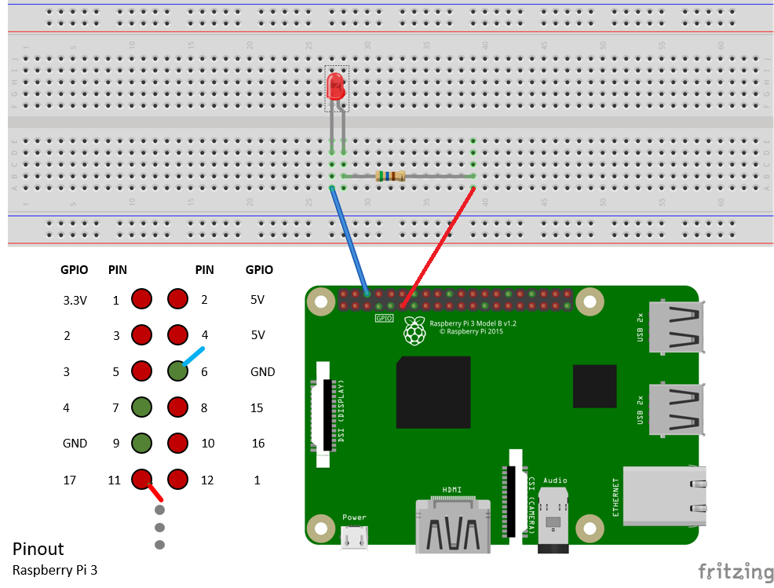

# Configure your device
## What you will do
Add an LED to the breadboard and connect it to Pi

## What you will learn
In this article, you will learn:

* How to add an LED to the breadboard and connect it to Pi.

## What you need
To complete this operation, you need the following parts from your Raspberry Pi 3 Starter Kit:

* The Raspberry Pi 3 board as setup previously
* The breadboard
* Connector wires
* A 560-ohm resistor
* A diffused 10-mm LED
* The Ethernet cable

## Connect the LED to Pi
To complete this task, use the [breadboard](https://learn.sparkfun.com/tutorials/how-to-use-a-breadboard), the connector wires, the LED, and the resistor. Connect them to the [general-purpose input/output](https://www.raspberrypi.org/documentation/usage/gpio/) (GPIO) ports of Pi.

1. Connect the shorter leg of the LED to **GPIO GND (Pin 6)**.
2. Connect the longer leg of the LED to one leg of the resistor.
3. Connect the other leg of the resistor to **GPIO 0 (Pin 11)**.

Note that the LED polarity is important. This polarity setting is commonly known as Active Low.

Congratulations! You've successfully configured Pi.

## Summary
In this article, you’ve learned how to configure Pi by installing Windows 10 IoT-Core, connecting Pi to a network, and connecting an LED to Pi. Note that the LED doesn't yet light up. The next task is to install the necessary tools and software in preparation for running a sample application on Pi.

## Next steps
[Create and deploy the blink application](iot-hub-raspberry-pi-kit-win-10-iot-core-cs-lesson1-deploy-blink-app.md)

